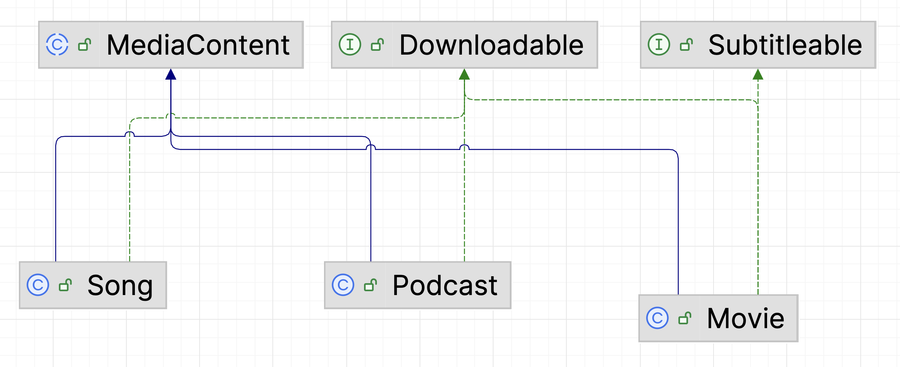

# StreamingPlatform Skill Builder

## Learning Outcomes

Upon completing these tasks, you will be able to:
- Implement methods for managing media content within a streaming platform.
- Apply conditional logic and iteration to process collections of objects.
- Utilize interfaces to handle polymorphic behavior (Downloadable).
- Practice object-oriented programming principles in a practical context.

---

## Introduction

This project simulates a streaming platform, demonstrating core object-oriented programming concepts such as inheritance, polymorphism, and interfaces. You will be completing methods within the `StreamingPlatform` class to manage various types of media content.

### Class Hierarchy and Interfaces

The platform manages different kinds of media, all stemming from a common abstract base class `MediaContent`. Specific types of media like `Movie`, `Podcast`, and `Song` extend `MediaContent` and implement relevant interfaces.

*   **`MediaContent` (Abstract Class)**: The foundational class for all media. It defines common properties like title, creator, duration, and rating, along with abstract methods that concrete media types must implement (e.g., `play()`, `getContentType()`, `getRecommendationTag()`).
*   **`Movie`**: Extends `MediaContent` and represents a film. It includes movie-specific details like PG rating and genre, and implements both the `Downloadable` and `Subtitleable` interfaces.
*   **`Podcast`**: Extends `MediaContent` and represents a podcast episode. It contains information such as the show name, episode number, and category, and implements the `Downloadable` interface.
*   **`Song`**: Extends `MediaContent` and represents a music track. It specifies genre, album, and explicit content status, and implements the `Downloadable` interface.
*   **`Downloadable` (Interface)**: Defines the contract for any media content that can be downloaded for offline use. Classes implementing this interface must provide methods for downloading, checking download status, and estimating file size.
*   **`Subtitleable` (Interface)**: Defines the contract for video content that supports multiple language subtitle tracks. Classes implementing this interface provide methods for enabling/disabling subtitles, getting the current language, and listing available languages.

The following diagram illustrates the relationships between these classes and interfaces:

---

## Tasks to be Completed

To utilize the above media class structure above, we need a platform by which we can manage our media.  The `StreamingPlatform` class provides such functionality, but needs implementation of several methods as follows.

### 1. `addContent(MediaContent m)`

**Task:** Implement the `addContent` method. This method should add the given `MediaContent` object `m` to the `library` (an `ArrayList<MediaContent>`) of the `StreamingPlatform`.

---

### 2. `findByType(String type)`

**Task:** Implement the `findByType` method. This method should iterate through the `library` and return a `List<MediaContent>` containing all content whose `getContentType()` matches the given `type` string. The comparison should be case-insensitive (i.e. use String's `equalsIgnoreCase` method).

---

### 3. `getTopRated(double minRating)`

**Task:** Implement the `getTopRated` method. This method should iterate through the `library` and return a `List<MediaContent>` containing all content with a `rating` greater than or equal to `minRating`.

---

### 4. `recommend(MediaContent item)`

**Task:** Implement the `recommend` method. This method is a BONUS task. It should find other `MediaContent` items in the `library` that share the same recommendation tag as the given `item` AND have a `duration` within 20% of the given `item`'s `duration`. The method should return a `List<MediaContent>` of these recommendations.
The duration range for a recommended item `r` is `item.getDuration() * 0.8 <= r.getDuration() <= item.getDuration() * 1.2`.
The recommendation tag comparison should be done using `item.getRecommendationTag().equals(m.getRecommendationTag())`.

---

## Submission

Submit the `StreamingPlatform.java` file on CodeGrade when you have completed the work.  Should it be worthy (it always is), the Game Guru will then score your work and add it to the dev release.
